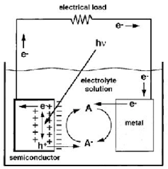
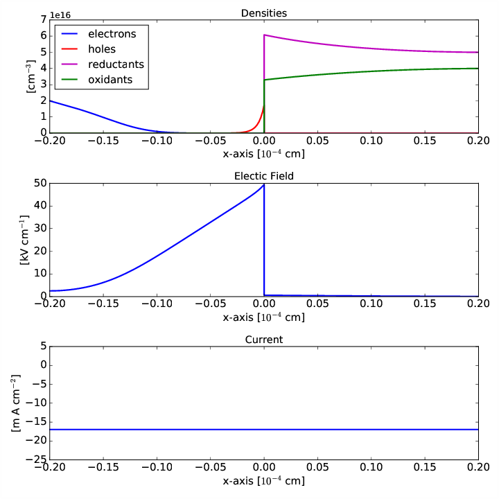

# PhotoElectrochemical Cell Simulator

## Introduction

### Photoelectrochemical Solar Cells

Large-scale utilization of photovoltaic (PV) devices, or solar cells, has been hampered 
for years due to high costs and lack of energy storage mechanisms.  <a href="https://en.wikipedia.org/wiki/Photoelectrochemical_cell">Photoelectrochemical solar cells</a>  (PECs), are an attractive alternative to conventional solid state PV devices.  PECs such as those depicted below are able to directly convert solar energy into hydrogen fuel.  The hydrogen fuel can then be used at a later time to generate electricity. The typical setup of a PEC is shown below,

A PEC consists of four main components: the solid semiconductor electrode, the liquid electrolyte component, the semiconductor-electrolyte interface and the counter (metal or semiconductor) electrode.  When sunlight shines on the semiconductor component, photons are absorbed and generate electron-hole pairs. These electrons and holes are separated by a built-in electric field within the semiconductor. The separation of the electrons and holes leads to an electrical current in the cell and the accumulation of charges at the semiconductor-electrolyte interface.  At the interface, the photo-generated electrons or holes induce a chemical reaction at the semiconductor electrode. A similar chemical reaction also occurs at the counter electrode. These chemical reactions at the electrode interfaces create or eliminate reductant-oxidant (redox) species in the electrolyte leading to the generation of hydrogen fuel.  

### Software Overview

This software is designed to simulate the dynamics of the reactive interface between a semiconductor and electrolyte in a 1D. The interface of between the semiconductor and electrolyte make up a "half cell" of a  <a href="https://en.wikipedia.org/wiki/Photoelectrochemical_cell">photoelectrochemical cell</a>. The main challenges in constructing a numerical algorithms that produces reliable simulations of PECs are due to the highly nonlinear nature of the system and the different time scales of the semicondcutor and electrolye charge carriers.  Furthermore, regions of stiffness caused by boundary layer formation where sharp transitions in densities and electric potential occur near the interface (as shown below) and pose severe constraints on the choice of discretization strategy in order to maintain numerical stability.

The resulting output files from the simulation are in <code>.dat</code> format and can viewed using the python <code>plotter.py</code> script in <code>/run/</code> directoy.  The results of one simulation are shown below,

This code will automatically run in parallel using the <a href="http://www.openmp.org/">OpenMP</a> for multithreading if the library is present.

For **much more** background on the model and algorithms used in this project please see the  2D <a href="http://mdh266.github.io/PECS/">documentation page</a>.

## Dependencies:
1. <a href="https://cmake.org/">CMAKE 2.8</a>   (Required)
2. <a href="https://www.gnu.org/software/gsl/"> GSL 1.16</a>	(Required)
3. <a href="http://eigen.tuxfamily.org/">EIGEN 3.0</a>   (Required)
4. <a href="http://www.boost.org/">BOOST</a>      (Required)
5. <a href="http://www.openmp.org/"> OpenMP</a> 	(Optional)
6. <a href="https://www.python.org/"> Python</a>, <a href="http://www.numpy.org/">NumPy</a> and <a href="http://matplotlib.org/">matplotlib </a> for visualization. (Optional)

## Installing

After installing all the dependencies for this code, go into the <code>PECS-1D/</code> directory.  Then use the following command in the terminal,

	mkdir build
	cd build 
	cmake  ..
	make solar_cell_app
	mv solar_cell_app ../run

## Using the software
From your terminal, cd in to the  <code>run</code> directory.  If you want to use multi-threading you need to first type into your terminal,
		
		export OMP_NUM_THREADS=num_threads

where <code>num_threads</code> is the number of cores on your machine.

To set the paremeter values into you need to change the values in the input file,

	 	ddp-input.ini 

see the <a href="http://mdh266.github.io/PECS/">documentation page</a> for more datails on parameter values.

To run the code, type the following command from the <code>run/</code> directory,
			
		./solar_cell_app

If you want to change the doping/concentration profiles change the file the <code>ConcentrationProfile</code> directory.  All units (densities and space) in these files are in non-dimensional form.  You will need to recompile if you change any of these files, i.e. use the steps,

make solar_cell_app
mv solar_cell_app ../run

The data output files are labeled <code>StateXXXX.dat</code> where XXXX are specific numbers and contain the information,
	
	 when (xvalues < 0)
		 xvalues, electron density, hole density, electric field, potential, current, time

	 when	(xvalues > 0)
		 xvalues, reductant density, oxidante density, electric field, potential, current, time

To make visualizations of the simulations use the Python script <code>plotter.py</code> in directory <code>run</code> by typing the command,
		
		python plotter.py

To get rid of simulation produced files <code>.dats</code>, </code>.png</code>, <code>.mp4</code> invoke:
		
		./clean.sh

Edit and use <code>Runner_IV.py</code> if you want to run this over multiple bias values.

## Testing

To test the code run the following commands from the <code>build/</code> directory,

	make test_System
	./test_System

You will then receive a report back of whether the code passed all the tests.

## Documentation

If you want to build the documentation for this code tou must have
doxygen and latex installed.  Once it is has been obtained, from the <code>documentation</code> 
directory type the command,

	doxygen dox

and a html file website we be built in the directory <code>html/</code>.  This
can be viewed from any web browser by opening the <code>index.html</code> file within the directory.

## Trouble Shooting
* If oscillations appear in semiconductor domain (usually on the electron densities) 
use a smaller value for the timeStepFactor. 

**NOTE: will slow down run time.**

* If you see negative values/spikes/stability issues (NANs) in your results then increase the numBoundaryElements (make sure to 
increase numElements so that numBoundaryElementsremains less than numElements). 
Also, if this issue area is outside of the boundaryLayerWidth region, increase boundaryLayerWidth 
so that it covers these issue areas.  

**NOTE: will slow down run time**
